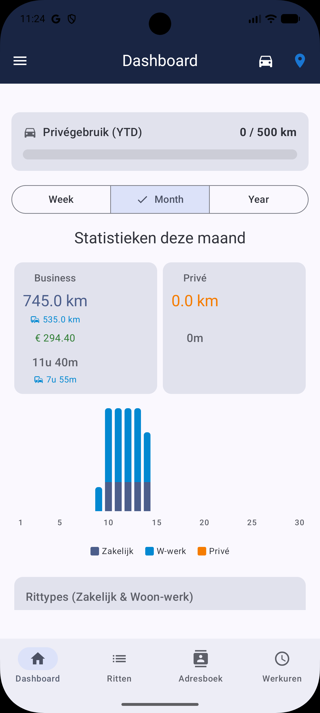
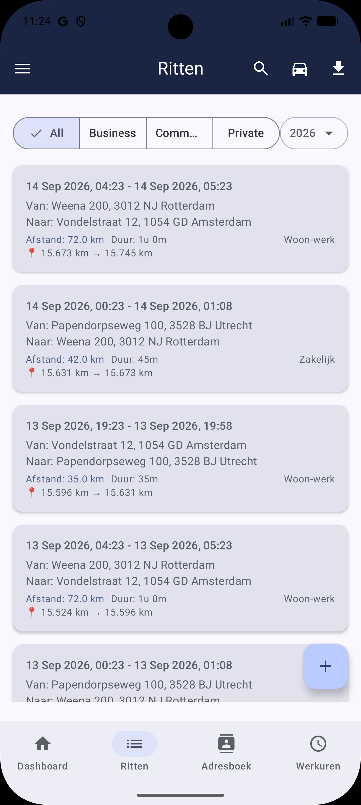
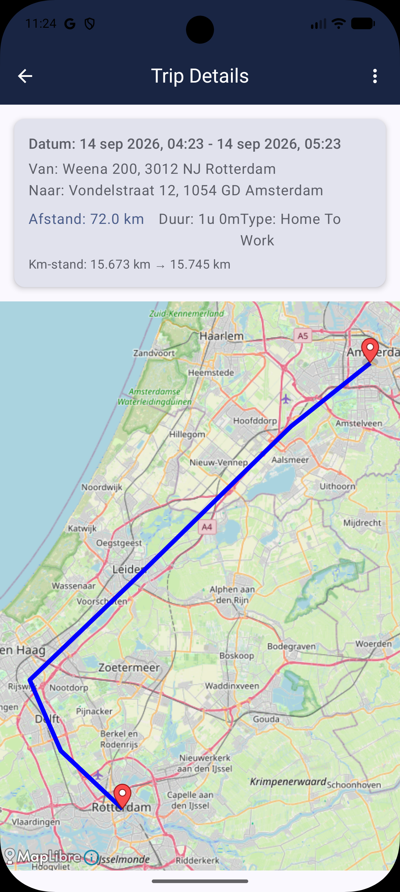
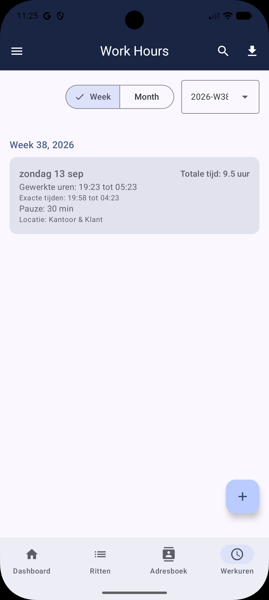
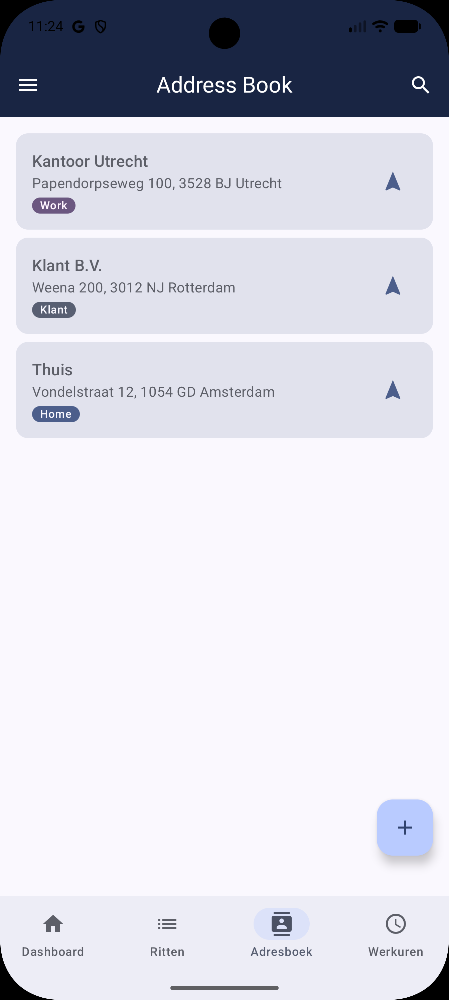
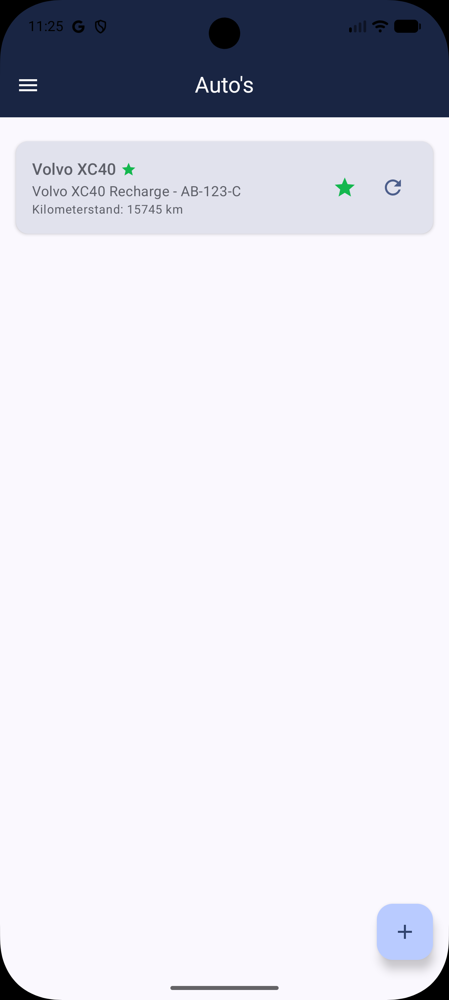

# CIMDriver v1.0.8

De eerste officiële release van **CIMDriver** (*Car In-route Metrics Driver*), de moderne en slimme ritten- en werkurenregistratie app voor Android. 

## 🆕 Wat is nieuw in v1.0.8
- **Stricte Adres Matching:** De logica voor het koppelen van start/eind locaties aan je adresboek is volledig herschreven met een prioriteitenmodel. Het willekeurig overschrijven van adressen bij meerdere matches in de buurt is opgelost: de dichtstbijzijnde kandidaat wint nu áltijd.

## 🚀 Wat is het?
- **Volledig Automatische Ritregistratie:** Zodra je Bluetooth (bijv. de carkit) verbindt, begint CIMDriver de rit te loggen. Bij het verbreken van de verbinding wordt de rit netjes gestopt en geclassificeerd (Zakelijk, Privé, of Woon-werk) via slimme locatie-herkenning.
- **Geautomatiseerde Werkuren:** CIMDriver houdt niet alleen je gereden kilometers bij, maar detecteert ook wanneer je op kantoor of bij een klant aankomt. Werkdagen worden hierdoor automatisch gestart, tussendoor gepauzeerd, en gestopt zodra je thuis bent. Geen gedoe meer met handmatig inklokken!
- **Slimme Uren-tolerantie:** Vertrek je 5 minuutjes later? CIMDriver rondt werktijden binnen een (door jou instelbare) marge soepel af naar je vaste werktijden, zodat je urenoverzicht altijd netjes en werkbaar blijft voor de administratie.
- **Rijk & Modern Dashboard:** Inzichten per week, maand, en jaar in een gelikte interface.
- **Privacy First:** Alle ritten en locaties blijven uitsluitend lokaal in de Room-database op je eigen toestel, totdat jij ze als Excel (CSV) exporteert.

👉 **[Bekijk de complete lijst met alle functionaliteiten hier](release/FEATURES.md)**

## 📦 Installatie
> [!IMPORTANT]
> **Compatibiliteit:** CIMDriver vereist **Android 10 (API 29) of nieuwer**.
> *Binnenkort:* Volledige integratie voor **Android Auto** volgt zodra de benodigde Google Play Developer licentie is afgerond!

1. [Download het bestand CIMDriver-v1.0.8.apk](release/CIMDriver-v1.0.8.apk) (direct vanuit de repository).
2. Open de APK op je telefoon. 
3. *Opmerking:* Omdat de app nog niet in de Play Store staat, vraagt je telefoon waarschijnlijk om toestemming om "Onbekende bronnen" toe te staan. Accepteer dit om de installatie te voltooien.

## 📸 Screenshots

| Dashboard | Rittenlijst | Rit Details |
| :---: | :---: | :---: |
|  |  |  |
| **Werkuren** | **Adresboek** | **Voertuigen** |
|  |  |  |

## ❤️ Support
Als je deze app handig vindt en de ontwikkeling wilt steunen, trakteer me dan op een kopje koffie!

---
*Gebouwd met trots en Kotlin, door Antigravity & Remco.*
