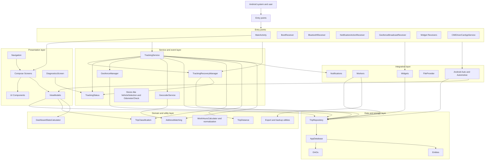

# Architecture Diagram

The diagram below provides an overview of the main architecture of CIMDriver. It aligns with the layered setup featuring entry points, UI, services, data storage, and integration layers such as widgets, workers, and Android Auto/Automotive.

## Mermaid diagram

## Reading guide

The diagram shows that CIMDriver has multiple entry points: not only the phone UI, but also boot events, Bluetooth events, notification actions, widgets, and car integration. The `TrackingService` is the operational centerpiece of automatic trip registration and collaborates with recovery, status, geofence, and geocoder components.

Additionally, the diagram illustrates that ViewModels and services do not operate directly on loose tables, but via repository and data layers with Room components. Domain and utility logic such as classification, distance determination, address matching, and work hours calculation support both the UI and background processes.
