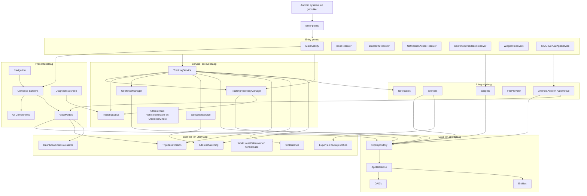

# Architectuurdiagram

Onderstaand diagram geeft een overzicht van de hoofdarchitectuur van CIMDriver. Het sluit aan op de gelaagde opzet met entrypoints, UI, services, dataopslag en integratielagen zoals widgets, workers en Android Auto/Automotive.

## Mermaid-diagram

## Leeswijzer

Het diagram toont dat CIMDriver meerdere ingangen heeft: niet alleen de telefoon-UI, maar ook boot-events, Bluetooth-events, notificatieacties, widgets en car-integratie. De `TrackingService` vormt het operationele middelpunt van automatische ritregistratie en werkt samen met recovery-, status-, geofence- en geocodercomponenten.

Daarnaast laat het diagram zien dat ViewModels en services niet rechtstreeks op losse tabellen werken, maar via repository- en datalagen met Room-componenten. Domein- en utilitylogica zoals classificatie, afstandsbepaling, adresmatching en werkurenberekening ondersteunen zowel de UI als de achtergrondprocessen.
