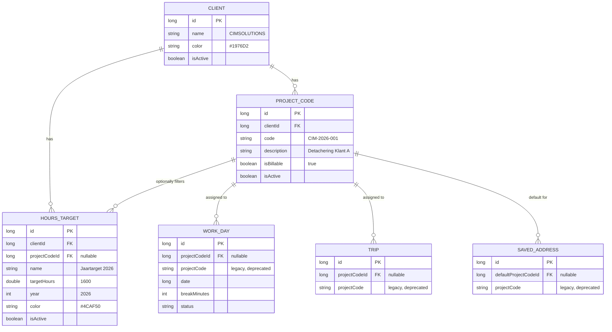

# Gegevensmodel

CIMDriver gebruikt een lokale Room-database als kern van de gegevensverwerking. De codebasis bevat `AppDatabase`, DAO's, entiteiten en een repositorylaag rond ritgegevens.

## Kernonderdelen

| Onderdeel | Rol |
|---|---|
| `AppDatabase` | Centrale lokale database van de applicatie. |
| `ClassificationRuleDao` en overige DAO-bestanden | CRUD- en querytoegang tot opgeslagen gegevens. |
| `Entities.kt` | Datamodellen die persistent worden opgeslagen. |
| `TripRepository` | Toegangspunt tussen hogere lagen en ritgegevensopslag. |

## ER Diagram (Klanten, Projecten & Uren Targets)

Hieronder staat het entity-relationship diagram voor de nieuwe functionaliteit rondom klanten, projectcodes en targets voor declarabele uren.

## Opslagfilosofie

De bestaande README beschrijft expliciet dat ritten en locaties lokaal op het toestel blijven in een Room-database totdat de gebruiker zelf exporteert. Daarmee is de datalaag niet alleen technisch maar ook functioneel en privacygerelateerd een hoofdonderdeel van de app.

## Datastromen

Tracking, classificatie, dashboards, voertuigen, adressen, werkuren en exportfunctionaliteit vertrouwen op dezelfde lokale gegevenslaag. Daardoor moet documentatie duidelijk maken welke entiteiten door welke processen worden gebruikt en welke afleidingen of aggregaties in hogere lagen plaatsvinden.

## Documentatierichtlijnen

Een volledige datadocumentatie moet per entiteit en DAO minimaal vastleggen: doel, sleutelvelden, relaties, lifecycle van de gegevens, bron van de data, updatepaden en exportrelevantie. De huidige documentatie vormt hiervoor het kader; nadere detaildocumentatie kan per tabel of entiteit worden toegevoegd wanneer het onderhoud dat vraagt.
